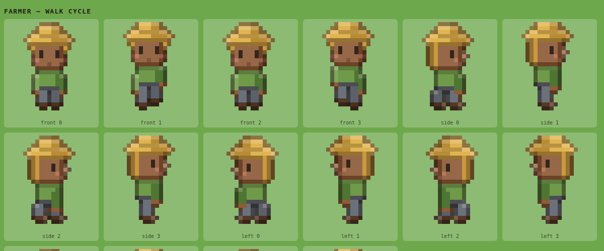

# Crossroads

An art-style test for an idle/simulation game about roads. Roads get worn in
first, crossings turn into markets, and markets turn into towns — this demo is a
snapshot of one such crossroads mid-life, with villagers and travellers actually
doing business in the square.

It runs entirely in the browser. No build step, no dependencies, no backend.


## Run it

ES modules need to be served over HTTP (opening `index.html` from the file
system will fail on CORS), so:

```sh
python3 -m http.server 8000
# then open http://localhost:8000/
```

Any static server works — `npx serve`, `caddy file-server`, whatever you have.

## Put it online (GitHub Pages)

There's nothing to build, and every path in the project is relative, so the
repo can be served as-is — including from a project subpath like
`https://<user>.github.io/crossroads/`.

Go to **[Settings → Pages](https://github.com/benedicthsieh/crossroads/settings/pages)**
and set **Source: "Deploy from a branch" → Branch: `main`, Folder: `/ (root)`
→ Save.**

The demo lands at `/` and the sprite sheet at `/sprites.html`. The empty
`.nojekyll` file at the repo root tells Pages to publish the files verbatim
instead of running them through Jekyll first.

Two things to know before you flip it on:

- **Pages needs a public repo on the GitHub Free plan.** For a private repo you
  need Pro, Team or Enterprise Cloud.
- **The published site is public either way.** Making a private repo's Pages
  site private requires Enterprise Cloud, so on any other plan, publishing puts
  the demo on the open web even though the code stays private.

A GitHub Actions workflow is the other route, and worth switching to if this
ever grows a build step. It buys nothing today.

## What you're looking at

Everyone on the map is running an errand, and goods and coin actually change
hands at each stop:

| Who | What they do |
| --- | --- |
| **Farmers** | Cut wheat in the fields, haul it to the produce stall, get paid |
| **The baker** | Buys grain at the stall, bakes at the shop (watch the chimney), sells bread |
| **Stallholders** | Stand behind their counters and trade with whoever walks up |
| **Villagers** | Fetch water from the well, shop for bread, go home |
| **Travellers** | Arrive on one road, trade in the square, rest at the inn, leave by another road |
| **Kids, chickens, a dog** | No economic purpose whatsoever |

Every transaction pops the goods and coin above the traders' heads, so you can
read the economy at a glance. The counters in the side panel tally it up.

**Controls:** drag to pan, scroll to zoom, click a villager to follow them,
space to pause. Arrow keys or WASD also pan.

Leave the day/night cycle running (or drag the `Time of day` slider) and the
lamps, shop windows and market stalls light up:


## The art

The look is aiming at the civilians in *They Are Billions*: tiny, chunky,
readable in a crowd, with a slightly oversized head for charm. Every sprite —
villagers, buildings, trees, icons, the terrain — is **generated in code as
pixel art at runtime**. There are no image files in this repo.

That sounds like a strange choice for an art test, but it's the reason the
`Look` panel works: the palette, pixel size, outline treatment, rim light and
shadow style are all live knobs, and changing one re-bakes the entire town so
you can judge two styles back to back in a second.

Three things do most of the stylistic work, all in `js/pixel.js`:

- **Selective outlining** — the silhouette is wrapped in a *darker version of
  whatever pixel it touches* rather than a flat black keyline. Much softer, and
  it keeps colour in the shadows. (Switch `Outline` to "Hard (inked)" to compare.)
- **Rim light** — any pixel whose sky-facing neighbour is empty gets brightened,
  faking a single soft light from above for free.
- **Integer scaling only** — sprites are authored at ~20px tall and blitted at
  2–6× with smoothing off, so a pixel is always a crisp square.

### `sprites.html`

A dev page that dumps every frame the game can draw — all roles, all four
views, the whole walk cycle, carried goods, tools, critters, icons and props —
at 8× on a grass-coloured field, with the same style controls. This is where the
character work actually happens; the game view is too small to judge a face in.



## Why it's built this way

[`DECISIONS.md`](DECISIONS.md) records the choices behind the demo — the
projection, the code-generated art, the perf fixes, and the rough edges I know
about.

## Layout

```
index.html      the demo
sprites.html    sprite-sheet dev page for art-directing the cast
js/pixel.js     pixel-art rasteriser: grid, outline, rim light, colour maths
js/palette.js   the three palettes and the live style knobs
js/sprites.js   villagers (body, hair, hats, carried goods), critters, icons
js/props.js     buildings, stalls, trees, scenery
js/world.js     road graph, plaza, prop placement, baked terrain
js/agents.js    who does what: jobs, routes, trades
js/fx.js        popups, sparkles, dust, chimney smoke, speech bubbles
js/game.js      camera, render loop, day/night lighting, UI wiring
```

Buildings share one `shell()` in `props.js` that draws the oblique 3/4 volume:
front wall face-on, depth receding up-right at 2:1, roof front plane visible.
The specialised trades (marketplace, warehouse, lumberyard, smithy) are
distinguished by silhouette rather than detail, because detail doesn't survive
at this size.

A few notes on the parts that aren't obvious:

- **Terrain is baked once.** `bakeGround()` paints the whole map at one logical
  pixel per pixel — grass speckle, road dither, wheel ruts, worn patches around
  doorways — then upscales it. The frame loop draws terrain in a single blit.
- **Depth sorting is by ground contact point.** A prop can override its sort key
  with `sortY`, which is how a stallholder ends up sandwiched between their own
  awning and their own counter.
- **Behaviour is a list of steps.** Each villager runs a looping script of
  `go` / `wait` / `take` / `trade` steps. It's deliberately shallow, but it's the
  same shape a real jobs-and-routes sim needs, so it should survive contact with
  the actual game.

## Deliberately not here

- **No backend.** Nothing is persisted; reloading resets the town.
- **No pathfinding.** Villagers walk in straight lines and gently push each
  other apart. The map is laid out so that's enough.
- **No growth.** The town is hand-placed. The whole premise of the game — roads
  accumulating traffic, junctions sprouting buildings — is the next thing to
  build, and `world.js` is the file where it goes: `ROADS` becomes state that
  the sim edits rather than a constant, and `PROPS` gets placed by rules
  instead of by hand.
