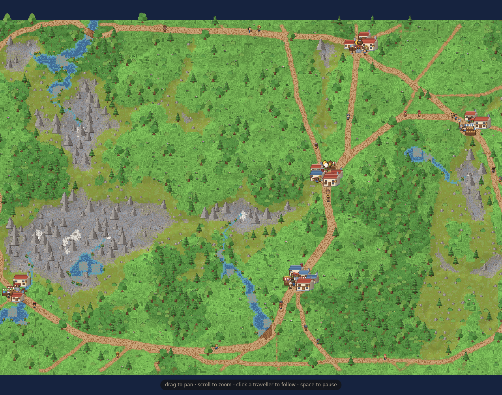
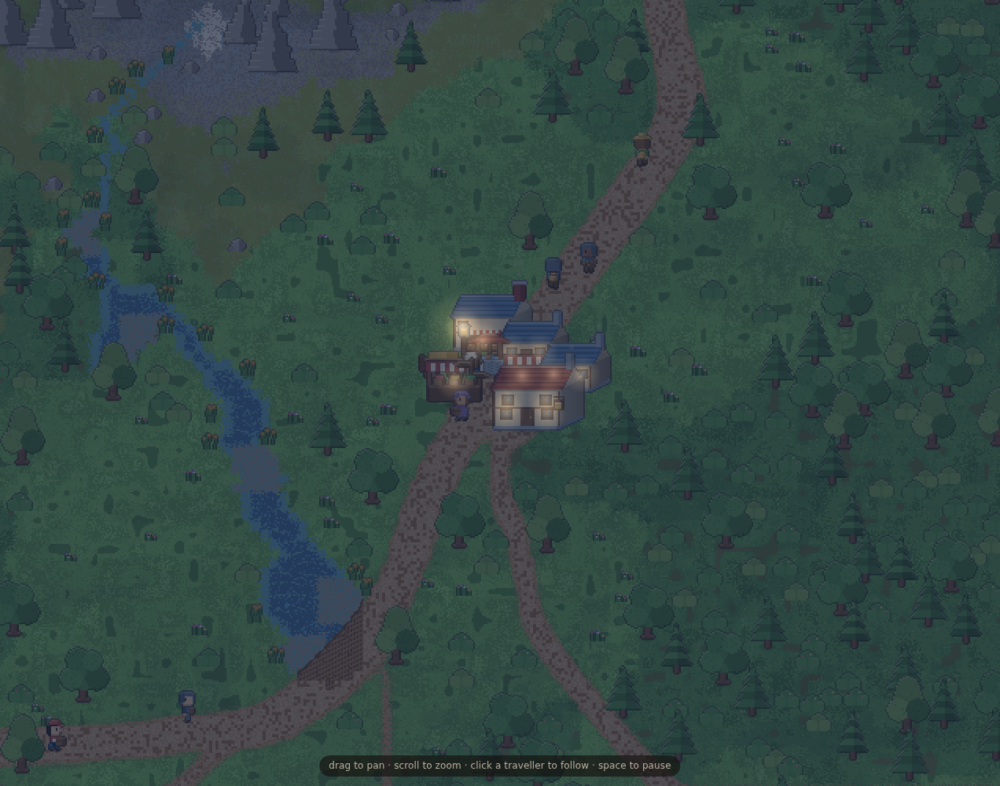

# Crossroads

An idle/simulation game about roads. Nothing on the map is placed by hand:
travellers cross a generated landscape, the ground they walk over wears down,
worn ground is cheaper to walk over than raw ground, and so traffic slowly
concentrates itself into roads. Where three or more roads end up meeting,
somebody digs a well — and a town grows on the crossroads.

It runs entirely in the browser. No build step, no dependencies, no backend.



## Run it

ES modules need to be served over HTTP (opening `index.html` from the file
system will fail on CORS), so:

```sh
python3 -m http.server 8000
# then open http://localhost:8000/
```

Any static server works — `npx serve`, `caddy file-server`, whatever you have.

## What you're watching

Give it a couple of minutes at 8× or 16× and the map builds itself, in order:

1. **Travellers cross.** They enter at a gap in the map edge and head for the
   far side, taking the cheapest route they can find.
2. **Terrain gets in the way.** Grassland is cheap, forest is slower, hills
   slower still, and mountain ridges and rivers are close to walls. So the
   first travellers are already funnelling through the same handful of passes
   and fords.
3. **Tracks appear.** Every step lays down wear, and wear makes ground cheaper.
   The faintest stipple of a shortcut pulls in the next traveller, and by the
   twentieth it is a track.
4. **Tracks thicken into roads and meet.** Heavily used routes widen; the
   junctions where two of them cross become the cheapest places on the map to
   be.
5. **Towns grow on the junctions.** A busy crossroads gets a well, then a stall,
   then an inn, then houses and trades — paid for by the traffic that keeps
   arriving. Travellers start routing *through* towns, which makes them busier
   still.
6. **A ford that gets busy enough becomes a bridge.**

None of that is scripted. The only authored thing on the map is how expensive
each kind of ground is to walk on.

**Controls:** drag to pan, scroll or the zoom slider to zoom, click a traveller
to follow them, space to pause. Arrow keys or WASD also pan. Clicking a town in
the side panel jumps to it.

## Saving and sharing

The game state is plain data kept completely apart from the rendering layer, so
a save is small and honest: the map seed, the road wear, the towns, and whoever
is currently walking. Terrain, scenery and in-flight routes are all regenerated
from the seed on load rather than stored.

- **Save / Load** use localStorage, and the game autosaves every 30 seconds.
- **Copy share code** puts the whole game in the clipboard as text. Paste it
  into another browser with **Paste code** and it continues from exactly there —
  same map, same roads, same people, same dice.

A few minutes of play is around 40 kB.

## The art

The look is aiming at the civilians in *They Are Billions*: tiny, chunky,
readable in a crowd, with a slightly oversized head for charm. Every sprite —
travellers, buildings, trees, crags, icons, the terrain — is **generated in code
as pixel art at runtime**. There are no image files in this repo.

Three things do most of the stylistic work, all in `js/pixel.js`:

- **Selective outlining** — the silhouette is wrapped in a *darker version of
  whatever pixel it touches* rather than a flat black keyline.
- **Rim light** — any pixel whose sky-facing neighbour is empty gets brightened,
  faking a single soft light from above for free.
- **Integer bake, continuous zoom** — sprites are baked on whole pixels at 1–3×
  and the camera makes up the rest, so zoom can run smoothly from a
  whole-map view to a close-up without the art ever landing on half a pixel.



### `demo/`

The art-style test this repo started as: a hand-placed market crossroads with
live palette, pixel size, outline, rim-light and shadow controls, plus
`demo/sprites.html`, which dumps every frame the game can draw at 8×. The game's
look is locked to the values chosen there, and the demo stays as the lab for
changing that decision.

## Layout

```
index.html          the game
demo/               the archived art-style test
js/pixel.js         pixel-art rasteriser
js/palette.js       palettes and the locked style values
js/sprites.js       villagers, critters, icons
js/props.js         buildings, stalls, trees, crags, rocks, reeds
js/sim/             the game state: terrain, roads, pathing, travellers, towns
js/render/          the view: camera, terrain bake, road layer, scene, scenery
js/game.js          boot, loop, input, HUD
```

The split between `js/sim/` and `js/render/` is strict and deliberate:
`js/sim/` has no DOM, no canvas and no `Math.random()` — all of its randomness
runs through a seeded generator whose entire state is one 32-bit integer. That
is what makes the game snapshottable mid-frame, resumable from localStorage,
and shareable as a string.

[`CLAUDE.md`](CLAUDE.md) has the working notes for the codebase — invariants,
tuning knobs, and how to verify a change. [`DECISIONS.md`](DECISIONS.md) records
why things are built the way they are.

## Put it online (GitHub Pages)

There's nothing to build, and every path in the project is relative, so the
repo can be served as-is — including from a project subpath like
`https://<user>.github.io/crossroads/`.

Go to **[Settings → Pages](https://github.com/benedicthsieh/crossroads/settings/pages)**
and set **Source: "Deploy from a branch" → Branch: `main`, Folder: `/ (root)`
→ Save.**

The game lands at `/`, the art test at `/demo/` and the sprite sheet at
`/demo/sprites.html`. The empty `.nojekyll` file at the repo root tells Pages to
publish the files verbatim instead of running them through Jekyll first.

Two things to know before you flip it on:

- **Pages needs a public repo on the GitHub Free plan.** For a private repo you
  need Pro, Team or Enterprise Cloud.
- **The published site is public either way.** Making a private repo's Pages
  site private requires Enterprise Cloud, so on any other plan, publishing puts
  the demo on the open web even though the code stays private.

## Deliberately not here

- **No backend.** Saves are local; sharing is copy-and-paste.
- **No economy inside towns yet.** Buildings appear, residents wander, but
  nobody has a job. The demo's step-script behaviours are the shape that goes
  here next.
- **No player.** Nothing to click on except the camera. The point so far is to
  make the map build itself convincingly.
